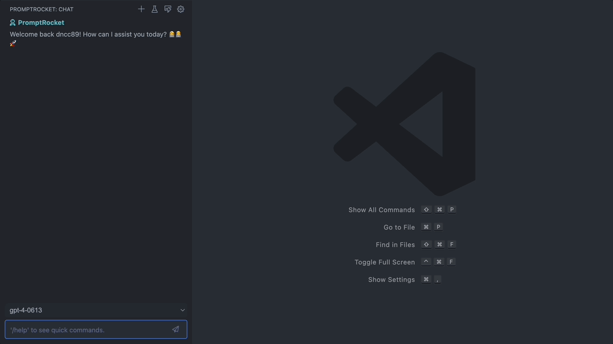

# PromptRocket



PromptRocket is a AI-powered extension for VSCode that effortlessly brings contextual understanding to your side panel. By intelligently analyzing your text selection, it grasps the context and provides relevant suggestions, enhancing your coding experience. Seamlessly integrate PromptRocket to your workflow, and watch your productivity soar through the power of AI-driven insights.
Check out the [PromptRocket GitHub repository](https://github.com/dncc89/PromptRocket) for more details and updates.

## What's the difference?
I had a hard time finding the perfect AI assistant, as there were many options but none catered to my needs for convenience and customization. Though GitHub's Copilot Chat is a top choice, it uses GPT-3.5 and Codex, which aren't the best performers at this moment. So, I decided to build my own custom AI assistant that fits my specific needs.

Here are some core principles of PromptRocket:

1. **Ensure full customization of the model and prompts.**

This is the primary reason I created this extension. It enables complete customization of the prompt, ranging from the system message to the incorporation of prompt engineering techniques, such as custom system messages, step-by-step thinking, and few-shot prompts, all geared towards eliciting the best possible response from GPT models.

2. **It should remember chat history while keeping track of text selections.**

PromptRocket tracks chat history and recognizes your text selections, as well as the context surrounding them. The main purpose of this extension is to boost brainstorming by integrating ChatGPT's conversational format into VSCode.

3. **Maintain a simple and tidy UI that doesn't disrupt visuals.**

I promise there won't be any flashy elements in the panel.


# How to Use
PromptRocket provides two ways of use, chat mode and command mode.

## Customizable Chat Mode 
Realizing the importance of convenience and customization, our chat mode lets you start a blank chat or use a custom template. Some templates might need extra context for better functionality. PromptRocket's smart text recognition guarantees accurate responses and full context understanding. Its ability to smoothly follow your focus across multiple files or code sections gives you a deeper insight.

- **New Chat** - Launches a new, empty chat free of templates.
- **Open Chat Template** - Begins a chat utilizing a personalized template.

## Simplified Command Mode
Catering to your need for a streamlined experience, our command mode operates directly within the editor. It's perfect for uncomplicated tasks, such as generating code snippets or incorporating comments. GPT-4 compatibility makes it a recommended choice.

- **Run Editor Command** - Executes a command inside the editor, specifically designed for template mode. 
Shortcut is **ctrl(cmd) + shift + ;**.

## Extra functions
It also has a few extra functions for your quality of life.

### Commands

- **Insert Last Codeblock to Editor** - This command automatically inserts the last codeblock in the chat into your editor.
- **Send a Message to Chat** - Acts as a handy shortcut for sending messages to the chat. Just press **ctrl(cmd) + shift + '**, yon't need to use mouse!

### General

- **Copy or Insert Text into Editor** - Just select any text in the chat, it will display a group of buttons to copy text to clipboard, or send into editor.

# Prompt Template Examples
In PromptRocket, you can create various command templates and utilize Few-Shot Prompts by incorporating example conversations. While PromptRocket supplies default prompts for coding, you can also craft your own templates for general writing tasks.

Here's one of the basic examples.
```json
{
    "name": "Identify Issues",
    "argument": false,
    "prompts": [
    {
        "role": "system",
        "content": "You are a powerful AI programming assistant well-versed in debugging code across various programming languages. Identify issues with the provided code and offer solutions."
    },
    {
        "role": "user",
        "content": "Here's my code written in {{language}}:\\n```{{context_before}}{{selected_text}}{{context_after}}```"
    },
    {
        "role": "user",
        "content": "Please identify any issues with this code and suggest how to fix them."
    }
    ]
}
```

Here is a few-shot prompt example, which involves giving the AI a few examples of how it should respond, and reinforcing it with positive feedback. This greatly helps in keeping GPT-3.5's responses on track.

```json
{
    "name": "Write a Comment",
    "argument": false,
    "prompts": [
    {
        "role": "system",
        "content": "You are the most powerful programming assistant in the world, who is expert in all programming languages and algorithms. Perform the requested task, then only return the required text."
    },
    {
        "role": "user",
        "content": "```javascript console.log('Hello World!');```"
    },
    {
        "role": "assistant",
        "content": "// Write Hello World! to the console"
    },
    {
        "role": "user",
        "content": "That was perfect! Here's another one: ```python def generate_fibonacci(n): if n <= 1: return n else: return(generate_fibonacci(n-1) + generate_fibonacci(n-2))```"
    },
    {
        "role": "assistant",
        "content": "# Generate the nth Fibonacci number"
    },
    {
        "role": "user",
        "content": "That was perfect! Here's another one: \\n```{{language}} {{context_after}}```"
    }
    ]
}
```

Messages use the handlebar template format, enabling you to include editor information such as the context surrounding the cursor, selected text, and the current language.
Here's the complete list of tokens:
- {{language}} - File's language setting
- {{argument}} - Additional prompting for the template
- {{context_before}} - Context before the cursor position or selected text
- {{context_after}} - Context after the cursor position or selected text
- {{selected_text}} - Currently selected text